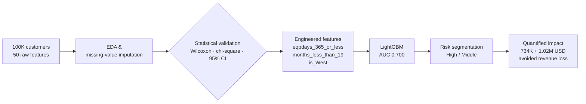
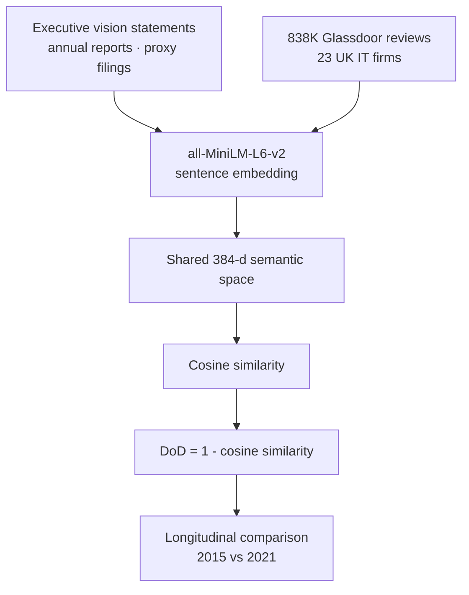
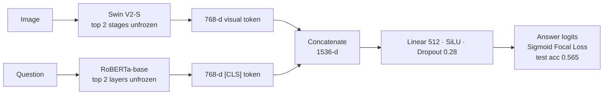

## 👋 Hi there, I'm Kirito

I'm an **M.S. in Information Management** student at the **University of Illinois Urbana-Champaign**, working on **organizational analysis with machine learning** — measuring things about people and organizations that were previously only measurable by survey.

I earned my B.S. in International Design Management at **Tokyo University of Science**, studying machine learning and AI in parallel with the core management curriculum. Since then I've shipped production AI systems in the HR and recruiting space, and I care about solving that industry's structural problems rather than decorating them with a model.

- 🔭 Currently: research on culture/organization measurement via LLM embeddings
- 🛠️ I like the full path — problem framing → data → model → the number that convinces a stakeholder
- 📫 Reach me: [LinkedIn](https://www.linkedin.com/in/kirito-takahashi-715046272/) · [Email](kiritot9110@gmail.com)

---

## 📋 Featured Projects

### 📉 Telecom Customer Churn Prediction & Business Proposal
Built an end-to-end churn model on a **100,000-customer, 50-feature** telecom dataset, then translated it into a client-facing business case.

- Benchmarked **LightGBM / XGBoost / Neural Network**, selecting LightGBM for the performance–interpretability trade-off (**AUC 0.700**)
- Engineered features from statistical evidence rather than intuition: `eqpdays_365_or_less`, `months_less_than_19`, and `is_West` (derived by cross-referencing carrier coverage maps) — each lifted AUC
- Validated every hypothesis with **inferential statistics**: Wilcoxon rank-sum tests, chi-square tests, and 95% confidence intervals on continuing vs. churned segments
- Segmented predicted probabilities into high/middle-risk cohorts and quantified intervention value at **$734K** and **$1.02M** in avoided revenue loss
- Delivered as a full proposal deck, including a pricing model and a plain-language glossary for non-technical decision makers

`Python` `LightGBM` `pandas` `scipy` `Hypothesis Testing` `Feature Engineering`

### 🏢 Quantifying the Semantic Gap Between Corporate Visions and Employee Perceptions
Undergraduate thesis proposing **Degree of Discrepancy (DoD)** — a transformer-based metric for the distance between what executives say a culture is and what employees experience.

- Processed **838K Glassdoor employee reviews** alongside manually collected executive vision statements from annual reports and proxy filings for **23 UK IT firms**
- Embedded both corpora into a shared **384-dimensional** space (`all-MiniLM-L6-v2`) and operationalized DoD as `1 − cosine similarity`
- Ran a **longitudinal (2015 vs. 2021)** design to capture pre/post-pandemic cultural drift
- Aggregate correlations were near zero; a **stratified analysis** of firms with rising discrepancy revealed a **moderate inverse relationship (r ≈ −0.60)** with culture-value ratings — the finding held only under a specific condition, and I reported it that way

`Python` `sentence-transformers` `Hugging Face` `NumPy` `Longitudinal Analysis`

### 🖼️ Visual Question Answering: Swin V2 × RoBERTa
Rebuilt a supplied ResNet-18 baseline into a multimodal transformer pipeline under fixed compute and time budgets.

- Replaced the backbone with **Swin Transformer V2-S** and the text encoder with **RoBERTa-base**, unfreezing only the top two stages/layers to keep fine-tuning affordable and limit catastrophic forgetting
- Concatenated both `[CLS]` embeddings into a 1536-d joint representation with a lightweight fusion head
- Switched hard labels to **soft labels** and adopted **Sigmoid Focal Loss** to handle a heavily skewed answer distribution
- Automated hyperparameter search with **Optuna** (layer-wise LRs, weight decay, cosine-annealing schedule); early stopping cut average runtime **~30%** with no accuracy loss
- Final test accuracy **0.565**, with an honest diagnosis of the remaining validation/test gap as overfitting to a shared image and answer space

`PyTorch` `Hugging Face` `Optuna` `Swin V2` `RoBERTa` `Multimodal Learning`

### 🤖 autoscout-agent — Recruiting Automation at Scale
Production recruiting automation deployed and running as an owned service.

- **Playwright + Gemini** pipeline sending **~2,000 personalized scout messages/month** on a Japanese recruiting platform
- Built and operated the full lifecycle: architecture, deployment, process management, remote operations, and a documented handoff to a successor engineer
- Designed a periodic whole-system audit with parallel read-only review agents to catch contract drift across the codebase

`Python` `Playwright` `Gemini API` `Node.js` `Cloudflare Workers` `Supabase (PostgreSQL)`

### 🎤 Applied LLM Systems (PodTech)
- **Speech-recognition sales support tool** for the bridal industry — turning unstructured client conversations into structured sales signal
- **RAG-based component recommendation system** over a domain product catalog

`Python` `RAG` `Vector Search` `LLM APIs` `GCP`

<b>More</b>

**Enterprise Architecture for Audit Firm DX** — Capstone designing an AI-driven ERP adoption roadmap (AIDAF + SAP Business AI) for a mid-tier Japanese audit firm, with a four-phase work plan and a KPI framework (−30% audit hours, <5% attrition, zero critical external-review findings). Client-facing consulting work: problem structuring, stakeholder framing, and measurable targets.

---

## 💡 Skills

### Languages

### Machine Learning & Data

**Methods:** hypothesis testing (Wilcoxon rank-sum, chi-square), confidence intervals, feature engineering, gradient boosting, transformer fine-tuning, sentence embeddings, RAG

### Cloud & Infrastructure

### Languages (human)
Japanese (native) · English (professional working)
